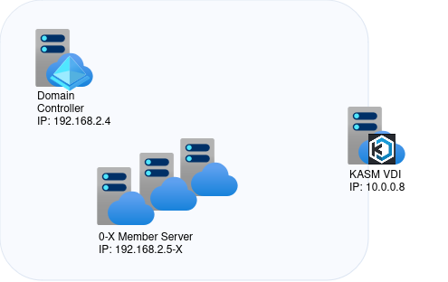

# Azure based AD Lab Environment
Azure ARM template to create a Windows active directory domain environment through the press of a button.
- 1 DC + a variable amount of member servers (0-x)
- Linux `jump host` with choosable OS (e.g. Kali, Remnux) based on [KASM](https://kasmweb.com/) 

## Setup

Press the button to start lab deployment within your Azure tenant.

- deployment takes approx. 20 min 
- once done, connect to KASM with the credentials specified during config wizard 
  - user: `admin@kasm.local`, password: _specified during setup_
  - left navbar: select `workspaces > register` and install an image
  - top navbar: switch to workspaces and start your image

## Lab systems
* Windows Server 2022 - domain controller
* Windows Servers 2022 - domain joined  
* Ubuntu 22.04LTS - KASM workspaces Virtual Desktop Infrastructure (VDI)

| system | IP | 
| --- | --- |
| Domain controller | 192.168.2.4 |
| Member server 1 | 192.168.2.5 |
| Member server 2 | 192.168.2.6 |
| Member server ... | ... |
| Member server x | 192.168.2.(4+x) |
| Kasm VDI | 10.0.0.2 |

# Acknowledgments
* DefensiveOrigins DOAZLAB: https://github.com/DefensiveOrigins/DO-LAB
* Microsoft Sentinel2Go: https://github.com/OTRF/Microsoft-Sentinel2Go
* OTRF Blacksmith Components: https://github.com/OTRF/Blacksmith
